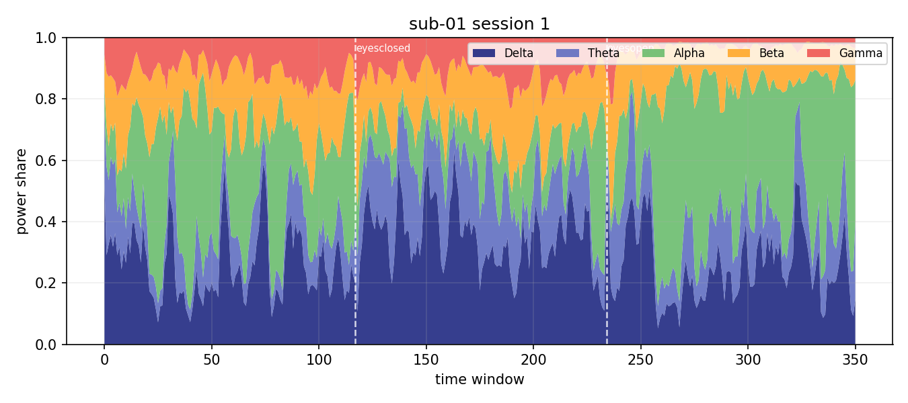

# EEG Mood-Sync

**Generative ambient music driven by real EEG band power (δ–γ).**

Pipeline transforms public resting-state / cognitive-task EEG into a dynamic soundscape. Includes ML models (task classification + BPM regression), interactive visualizations, and one-click WAV export.



**Demo video (45 s):** [`docs/demo.mp4`](docs/demo.mp4) — band plots + EEG-driven ambient audio.

---

## Problem

Can we build a **transparent, reproducible** link between brain oscillations and generative media — without claiming clinical mind-reading?

Most consumer BCI demos use opaque scores. This project shows the full path:

**raw EEG → band power → ML features → music parameters → MIDI/WAV**

---

## Solution

| Stage | What happens |
|-------|----------------|
| **Input** | OpenNeuro [ds004148](https://openneuro.org/datasets/ds004148) — eyes closed/open, subtraction, memory, music tasks |
| **DSP** | Welch PSD, bands δ 0.5–4, θ 4–8, α 8–13, β 13–30, γ 30–45 Hz |
| **ML** | Random Forest task classifier + Ridge BPM regressor |
| **Mapping** | Band mix → tempo, register, density, velocity, note length |
| **Output** | MIDI + WAV + band landscape plot + feature CSV |

---

## Stack

Python · MNE · SciPy · scikit-learn · mido · Streamlit · OpenNeuro (ds004148)

---

## Results (trained on sub-01…05, session 1, ds004148)

| Model | Metric | Value |
|-------|--------|-------|
| **Task classifier** (Random Forest, 5 bands) | hold-out accuracy | **61%** |
| | 5-fold CV accuracy | 32% ± 6% |
| **BPM regressor** (Ridge) | hold-out R² | **0.72** |
| | hold-out MAE | **5.2 BPM** |
| Training windows | n | **2925** |

Full report: `models/metrics.json` · confusion matrix: `docs/screenshots/confusion_matrix.png`

**Demo listening:** `outputs/sub01_portfolio.wav` (generate with command below).

---

## Quick start

Clone this repository, then:

```bash
python -m venv .venv && source .venv/bin/activate
pip install -r requirements.txt
pip install -e .
```

Download a dataset subset (optional, ~few GB for subjects 01–05):

```bash
bash scripts/download_subset.sh data/ds004148
```

### 1. Train ML models (needs local ds004148)

```bash
python -m eeg_mood_sync.cli train \
  --data-dir data/ds004148 \
  --subjects 1 2 3 4 5
```

### 2. Generate demo (MIDI + WAV + plots)

```bash
python -m eeg_mood_sync.cli openneuro \
  --data-dir data/ds004148 \
  --subject 1 --session 1 \
  --tasks eyesclosed eyesopen mathematic memory music \
  --out outputs/sub01.mid \
  --wav outputs/sub01.wav \
  --plot-png docs/screenshots/band_landscape.png \
  --ml-report \
  --dump-stats
```

Listen: open `outputs/sub01.wav` in any player.

### 3. Interactive UI

```bash
streamlit run streamlit_app.py
```

### Streamlit Cloud

1. Push repo to GitHub (without `data/` — dataset stays local or user downloads separately).
2. [share.streamlit.io](https://share.streamlit.io) → New app → `streamlit_app.py` → use `requirements.txt`.
3. For live EEG mode, mount dataset or ship a small sample in `data/sample/`.

---

## Project structure

```text
src/eeg_mood_sync/
  eeg.py           # band power extraction (δ–γ)
  mapping.py       # bands → music parameters
  ml_train.py      # classifier + regressor
  midi_gen.py      # ambient MIDI
  audio_render.py  # MIDI → WAV
  dataset_ds004148.py
  viz.py           # band landscape plots
  cli.py
streamlit_app.py
models/            # trained *.joblib (generated)
docs/screenshots/  # portfolio figures
```

---

## Limitations (stated explicitly)

- **Not clinical BCI** — band power is a coarse proxy for arousal/relaxation, not diagnosis.
- **Rule + ML hybrid** — BPM regressor learns from heuristic labels derived from the same bands; classifier is the stronger ML story.
- **Gamma** is sensitive to muscle artefact; interpret with caution.
- **Offline replay** — not real-time Muse/LSL (possible extension).
- **Simple sine WAV renderer** — for portfolio listening; swap FluidSynth for production quality.

---

## Extensions

- [ ] Muse / LSL live stream
- [ ] Compare ML vs rule-based mapping side-by-side
- [ ] Link with [eeg-mental-state-classifier](https://github.com/) (RELAX/FOCUS labels)
- [ ] Stable Diffusion prompt branch from band features

---

## Author

Minka Witke — portfolio project (AIML / neurotech)

## Dataset citation

Wang, Y., et al. (2022). *A test-retest resting and cognitive state EEG dataset.* OpenNeuro ds004148.  
https://doi.org/10.18112/openneuro.ds004148.v1.0.0
